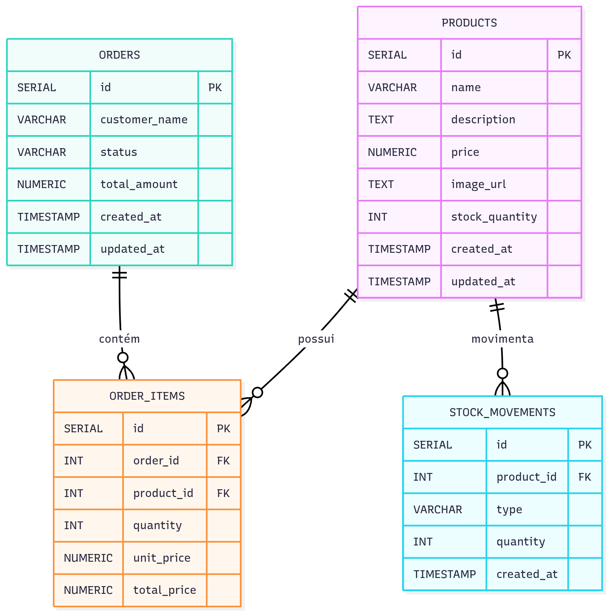

# 🛍️ Pedido Express

**Pedido Express** é um sistema web de pedidos rápido e inteligente, voltado para estabelecimentos locais que desejam digitalizar seu atendimento sem depender de aplicativos externos.  
Permite o gerenciamento de produtos, pedidos e controle de estoque de forma simples e eficiente.

- [🛍️ Pedido Express](#️-pedido-express)
  - [🚀 Tecnologias Utilizadas](#-tecnologias-utilizadas)
  - [🧱 Estrutura do Projeto](#-estrutura-do-projeto)
  - [🗃️ Estrutura do Banco de Dados](#️-estrutura-do-banco-de-dados)
  - [🧰 Instalação e Execução](#-instalação-e-execução)
  - [🧩 Scripts Principais](#-scripts-principais)
    - [🗃️ Comandos e Descrições](#️-comandos-e-descrições)
- [Este projeto está sob a licença MIT — veja o arquivo LICENSE para mais detalhes.](#este-projeto-está-sob-a-licença-mit--veja-o-arquivo-license-para-mais-detalhes)
- [Desenvolvido com ❤️ por Lucas Saladini](#desenvolvido-com-️-por-lucas-saladini)

---

## 🚀 Tecnologias Utilizadas

- **[Next.js 15](https://nextjs.org/)** — Framework React moderno com App Router  
- **TypeScript** — Tipagem estática para maior segurança no desenvolvimento  
- **[Shadcn/UI](https://ui.shadcn.com/)** — Biblioteca de componentes estilizados  
- **[Sonner](https://sonner.emilkowal.ski/)** — Sistema de notificações moderno  
- **[Zustand](https://zustand-demo.pmnd.rs/)** — Gerenciamento de estado simples e performático  
- **[@tanstack/react-query](https://tanstack.com/query)** — Gerenciamento de cache e sincronização de dados  
- **Supabase (PostgreSQL)** — Backend como serviço e banco de dados relacional  
- **ESLint + Prettier** — Padronização e qualidade de código  

---

## 🧱 Estrutura do Projeto
```
├── components.json
├── eslint.config.mjs
├── next.config.ts
├── package.json
├── postcss.config.mjs
├── public/
│ └── icons e imagens
├── src/
│ ├── app/
│ │ ├── layout.tsx
│ │ ├── page.tsx
│ │ └── globals.css
│ ├── components/
│ │ └── ui/
│ │ ├── button.tsx
│ │ ├── dialog.tsx
│ │ ├── input.tsx
│ │ ├── table.tsx
│ │ └── sonner.tsx
│ └── lib/
│ └── utils.ts
└── tsconfig.json
```

---

## 🗃️ Estrutura do Banco de Dados

O banco foi implementado em **PostgreSQL (via Supabase)**, com controle de produtos, pedidos e movimentações de estoque.



## 🧰 Instalação e Execução

Clone o repositório e instale as dependências:
```
git clone https://github.com/seu-usuario/pedido-express.git
cd pedido-express
npm install
```
Rode o servidor de desenvolvimento:
```
npm run dev
```
Acesse o app em http://localhost:3000

## 🧩 Scripts Principais

### 🗃️ Comandos e Descrições

| Coluna         |  Descrição                            |
| -------------- | ------------------------------------- |
| npm run dev    | Inicia o servidor de desenvolvimento  |
| npm run build  | Gera a build de produção              |
| npm run start  | Executa o servidor em modo produção   |
| npm run lint   | Verifica erros e formatação de código |


# Este projeto está sob a licença MIT — veja o arquivo LICENSE para mais detalhes.

# Desenvolvido com ❤️ por [Lucas Saladini](https://github.com/LucasSaladini)